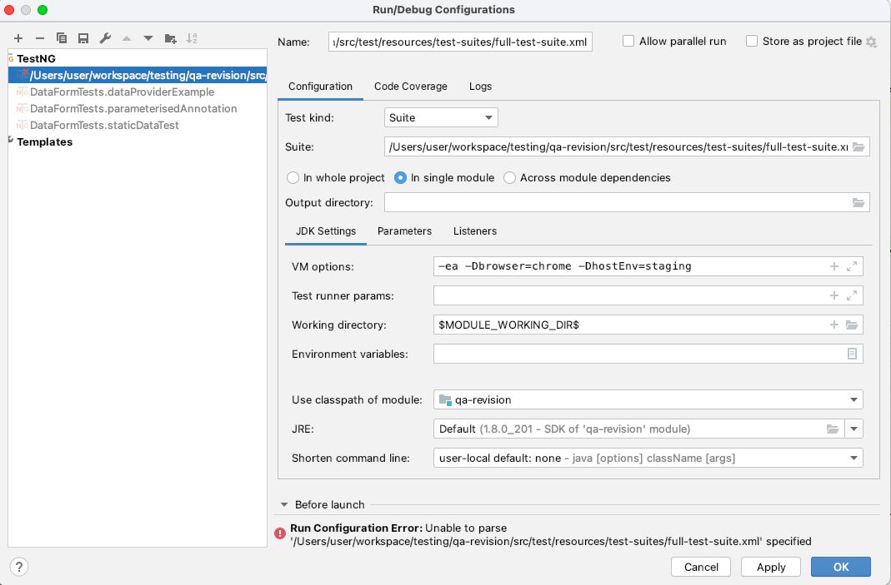

### **Selenium UI tests boilerplate code**

1. clone this repo and cd into into the root folder
2. install dependencies using `mvn clean install` 
3. Navigate into `qa-revision/src/test/resources` and execute following commands in different tabs of your system terminal.
   1. `java -jar selenium-server-standalone-3.141.59.jar`
   2. `./chromedriver`
   3.  In case you encounter error: "chromedriver" cannot be opened because the developer cannot be verified, then do following: `xattr -d com.apple.quarantine chromedirver`
4. Run python server `python3 -m http.server 8080` inside `qa-revision/src/test/resources/testWebsite`
___
**Common errors encountered:**

Note: All solutions are with respect to mac os Big sur : 11.1 (20C69) and IDE used is IntelliJ IDEA 2020.3.2 (Community Edition) 
1. intellij no compiler is provided in this environment. perhaps you are running on a jre rather than a jdk\
   **Solution**: Uninstall JRE by following instructions in [Uninstall Jre](https://docs.oracle.com/javase/9/install/installation-jdk-and-jre-macos.htm#JSJIG-GUID-7EB4F697-F3D1-40EA-ACDF-07FA90F02D57)
___

**FAQ's**:
1. <ins>How to set environment variables ?</ins> \
   In your ~/.zshrc or ~/.bash_profile set below variables as per your system config
```
export M2_HOME=$PATH:/usr/local/bin
export JAVA_HOME=$(/usr/libexec/java_home)
```
2. <ins>How to run tests via suite/xml file ?</ins>\
Right click on xml file where tests are defined and click on run.
   

3. <ins>How to run single test from terminal ?</ins>\
**Solution**: Try running `mvn test -Dtest=com.example.tests.formTests.FormTests` But if you find any issues with jdk version, add mvn compiler plugin in your pom file as below.
   ```
   <plugin>
    <artifactId>maven-compiler-plugin</artifactId>
    <configuration>
        <source>1.8</source>
        <target>1.8</target>
    </configuration>
   </plugin>
   ```
   or alternatively:
   ```
   <properties>
    <maven.compiler.target>1.8</maven.compiler.target>
    <maven.compiler.source>1.8</maven.compiler.source>
   </properties>
   ```
   One interesting thing we see in terminal logs is: 
   ```
   [INFO] --- maven-surefire-plugin:2.12.4:test (default-test) @ qa-revision ---
   [INFO] Surefire report directory: /Users/<username>/workspace/testing/qa-revision/target/surefire-reports
   ```
   surefire plugin is by default included in mvn \
running tests in parallel using maven-surefire-plugin: [link](https://www.youtube.com/watch?v=8mr1Z4LsU1I&ab_channel=AaronEvans)
   

4. <ins>Why maven -surefire-plugin ?</ins>\
Find answer [here.](https://stackoverflow.com/questions/33949658/why-surefire-plugin-is-need-in-maven)
   

5. <ins>How to read locally generated allure reports</ins> ?
Run this command in the project root folder: `mvn allure: serve`\
   more informatio here: https://github.com/allure-framework/allure-maven
   

6. <ins>How to run a specific suite xml file containing selected tests</ins> ?\
Use command: `mvn  test -DsuiteXmlFile=static_data_test`\
   make sure to add following config in **pom.xml** file:
   ```
   <suiteXmlFile>src/test/resources/test-suites/${suiteXmlFile}.xml</suiteXmlFile>```
   

7. <ins>How to configure environment variables in intellij while running tests in local</ins> ? (this is to mimic properties passed from jenkins)

These properties will be fetched in code by using `System.getProperty("browser");`


8. <ins>How to generate report and send over mail</ins> ?\
Once the suite file is run, report will be automatically generated because of the logic written in `onExecutionFinish()` of TestListener class.\
This automatically generated file can be used by jenkins job to send the mail report. (In jenkins script is written to do so.)

   
9. <ins>How to write xpaths</ins> ?
```
// selecting element by xpath
Syntax:
    @FindBy(xpath = "<refer_xpath_example>")
Examples:
    "//a[contains(@id,'some-unique-id')]"
    "//a[contains(text(),'Login / Signup')]"
    "//a[contains(@class,'ico-external-link')]/../a[contains(@href,'tags')]"
    "//span[contains(@data-goto-page,'example-dasboard')]/../div"
    "//i[contains(@class,'ico-spinner')]"
    //a[contains(@id,'unique') or contains(@id,'unique2') or contains(@id,'unique3')]
    
    "//tbody/tr[4]/td/div"
    "//table/tbody/tr[2]/td/table/tbody/tr[2]/td/div/table/tbody/tr/td)"
    "//div[text()='Name']/../input"
    
    "//span[@data-goto-page='example-dasboard-crm']/input"
    "//button[@class='aws-Button goButton']"
    "//div[@id='color-colorbox']/a/div[2]"
    "//div[@id='abc-dashboard-themeSettings-iconBg-colorbox']//a[contains(@style, 'display: block;overflow: visible;')]"
    "//input[@placeholder = 'New Password']"
    
    "//a[@id='abc-dashboard-see-live']/../../preceding-sibling::td/div/div"
    "//button[@id='colorsBack-3']/../following-sibling::div"
    "//input[@id='email']/ancestor::tr/following-sibling::tr//div[contains(text(), 'Enter an email')]"
    "//button[@title='Upload language files.']/../../div[2]//tr/td[1]//label"
    
    "//div[@id='unique']//p"
    "//*[@id='fr-link-insert-layer-1']/div[4]/button"
    //div[@id='abc-dashboard-settings-items']//img
    "//b[text()='+']/.."
    "//div//iframe"

    "//td/input[@type='text' and @class='gwt-TextBox']"
    "//label[.='First Step of Flow']"
    "(//div[@class='fr-element fr-view']/p)[2]"
    "//input[@checked][@name='Theme']/../label"

  
// selecting element by css selector
Syntax:
    @FindBy(css = "<refer_css_example>")
Examples:
    "p.SearchText"
    "input[id*='fr-abcButton-insert-layer-url']"
    "input#fr-link-insert-layer-url-2"
    "#abc-beacon-tip table table table"

```